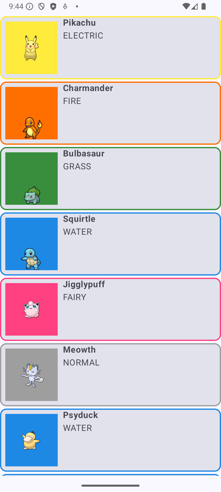
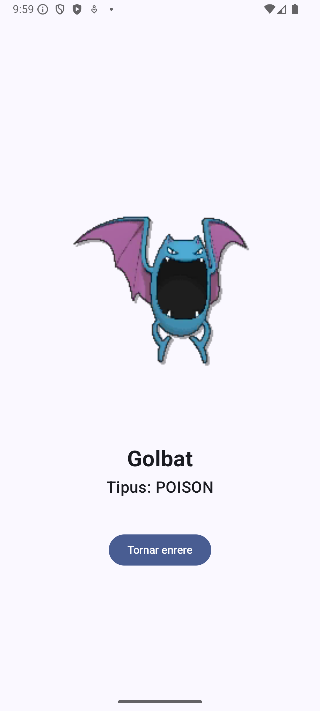

# Android App with RecyclerView -> Lazy* Components
## Android Studio Version
Android Studio Ladybug Feature Drop | 2024.2.2

## Language
Kotlin with JetPack Compose

## Purpose
This purpose of the main branch is a demo of the use of **Lazy Components**.
Other branches have further functionallities.

## Branch
- Branch `basic` is fully functional and it can be used in order to test different Lazy Components situations.
- Branch `detail-and-room` is fully functional and it can be used in order to play the game of cath'em all by adding pokemons to the pokédex using the pokéball placed in the DetailScreen. It contains:
    - Lazy Composables
    - Responsive clauses such as mediaqueries for screen size
    - LiveData
    - MVVM pattern
    - Navigation Routes
    - Retrofit library in order to consume API REST
    - Room library with a SQLLite database
---

# Gradle dependencies
If you want to expand the current project and include MVVM pattern, which is already in place through the packages, it is necessary to add the following dependencies in the file [`app/build.gradle.kts`](app/build.gradle.kts):

``` bash
dependencies {
    //This dependency provides the core components for using LiveData, ViewModel, and other lifecycle-aware components in your Android app. It's essential for implementing the MVVM architecture.
    implementation("androidx.lifecycle:lifecycle-runtime-ktx:2.6.1")
    //This dependency is crucial for observing LiveData objects within your Compose UI. It provides the observeAsState() function, which allows you to convert LiveData values into Compose state, enabling your UI to automatically update when the LiveData changes. Explanation:
    implementation("androidx.compose.runtime:runtime-livedata:1.7.5")
}
```

# Screenshot
## branch basic:


## branch main:




---
# References
- [Android Developers](https://developer.android.com/develop/ui/compose/lists?hl=es-419)
- [Medium](https://medium.com/@vivekbansal19/optimizing-lazy-list-in-jetpack-compose-best-practices-8da06a5dd472)
- [Medium](https://medium.com/@GiftWorthSharing/make-component-below-lazy-column-row-in-jetpack-compose-dfb91596030e)
- [Droidcon](https://www.droidcon.com/2024/01/03/mastering-lazy-lists-in-jetpack-compose-with-data-classes-and-mvi/)
